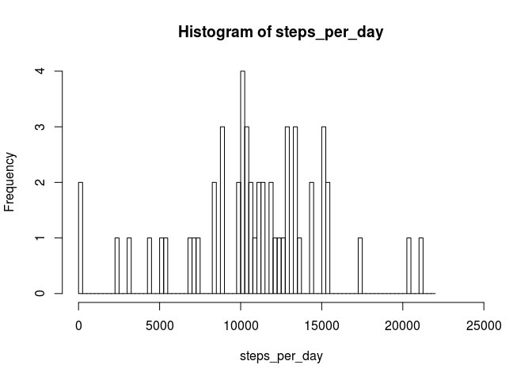
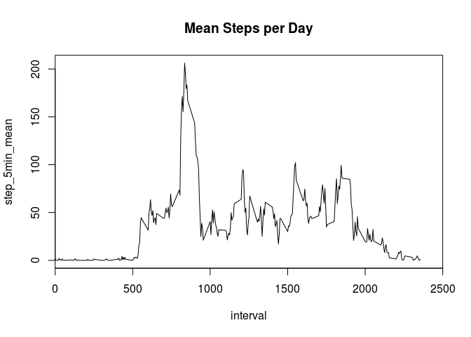

# Reproducible Research: Peer Assessment 1
## Notes ...
# 2015-10-16
# (1) 11:38 Initial commit to check git hub

## Loading and preprocessing the datat


```r
activity <- read.table(unz("activity.zip", "activity.csv"), header=T, quote="\"", sep=",")
dim(activity)
```

```
## [1] 17568     3
```

```r
str(activity)
```

```
## 'data.frame':	17568 obs. of  3 variables:
##  $ steps   : int  NA NA NA NA NA NA NA NA NA NA ...
##  $ date    : Factor w/ 61 levels "2012-10-01","2012-10-02",..: 1 1 1 1 1 1 1 1 1 1 ...
##  $ interval: int  0 5 10 15 20 25 30 35 40 45 ...
```


## What is mean total number of steps taken per day?

```r
library(dplyr)
```

```
## 
## Attaching package: 'dplyr'
## 
## The following objects are masked from 'package:stats':
## 
##     filter, lag
## 
## The following objects are masked from 'package:base':
## 
##     intersect, setdiff, setequal, union
```

```r
day_steps <- group_by (activity, date)
date_daysum <- summarize(day_steps, daysum = sum(steps))
ds1 <- matrix( select(date_daysum, daysum)  )
steps_per_day <- ds1[[1]]
hist(steps_per_day, breaks = seq(0,22000,250), xlim = c(0,25000) )
```

 

```r
mean_steps_per_day <- mean(ds1[[1]], na.rm = T)
print ( paste("Mean Steps per Day = ", mean_steps_per_day) )
```

```
## [1] "Mean Steps per Day =  10766.1886792453"
```

```r
median_steps_per_day <- median(ds1[[1]], na.rm = T)
print ( paste("Median Steps per Day = ", median_steps_per_day) )
```

```
## [1] "Median Steps per Day =  10765"
```

## What is the average daily activity pattern?

```r
df.int5 <- summarize(group_by(activity, interval), step_5min_mean = mean(steps, na.rm=T))
par(xaxs='i')
plot(df.int5, type = 'l', xlim=c(0,2500))
```

 

```r
print ( df.int5[df.int5$step_5min_mean ==  max(df.int5$step_5min_mean),] )
```

```
## Source: local data frame [1 x 2]
## 
##   interval step_5min_mean
## 1      835       206.1698
```

```r
print ( filter(df.int5, step_5min_mean == max(step_5min_mean)) )
```

```
## Source: local data frame [1 x 2]
## 
##   interval step_5min_mean
## 1      835       206.1698
```


## Imputing missing values


## Are there differences in activity patterns between weekdays and weekends?
